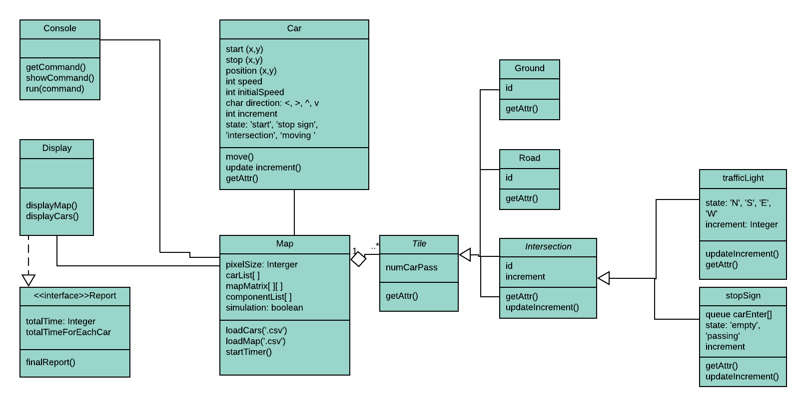

## Diagram

## Architecture design
- [Architecture Design - MVC](https://www.lucidchart.com/invitations/accept/98911987-f8bd-47e3-8a0c-b0ddf05494fb)

## Use case diagram 
- [Use case diagram](https://drive.google.com/file/d/1wBvyoXSj8t_jBm7rjeH1VZ2HX8ub-Lsa/view?usp=sharing)

> 

## Structural diagram/UML
- [UML diagram](https://www.lucidchart.com/invitations/accept/6ee82b63-ec81-4f8d-bdfb-3fc045e517da)

## Behavioral diagram / sequence diagram
1. User load CSV file indicate cars and components. [Link-Drawio](https://drive.google.com/file/d/1qm3FIPyAMxpd5HPVweYGlPJekhQPzlqz/view?usp=sharing)
2. Start/stop simulation. [link-Drawio](https://drive.google.com/file/d/1VDtcJRT7cKhE1pv3svX5ik8DDed5CQ7x/view?usp=sharing)
3. Track progress and show statistic of traffic. [Link-Drawio](https://drive.google.com/file/d/1bEp0_c48hDAUgdFj3U3z-ViFepZEGwe4/view?usp=sharing). [Lucidchart](https://www.lucidchart.com/invitations/accept/0cf8bdcd-cfe8-41ec-a35e-1f857fcd4d16)
4. System show final report. [link-Drawio](https://drive.google.com/file/d/1AzSBDgvGGS33l5jHEuxOFefS33k6Gowo/view?usp=sharing`). [LucidChart](https://www.lucidchart.com/invitations/accept/0cf8bdcd-cfe8-41ec-a35e-1f857fcd4d16)
5. Restart the simulation. [Link-Drawio](https://drive.google.com/file/d/1PZ1SLo7GoeJuJ8OX46XfDTM36NYwv-zz/view?usp=sharing). [Lucid](https://www.lucidchart.com/invitations/accept/0cf8bdcd-cfe8-41ec-a35e-1f857fcd4d16)

## Architecture design
- [Architecture Design - MVC](https://www.lucidchart.com/invitations/accept/98911987-f8bd-47e3-8a0c-b0ddf05494fb)

